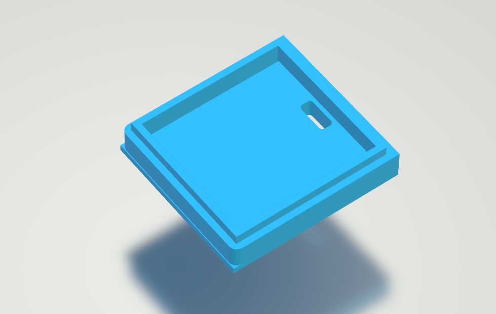

# WeatherStation with esp8266 and display ST7735

This project is a solution to have a real time weather station in a really small cube. It uses the API provided by OpenWeatherMap and requires a WiFi internet connection.  
For this guide i use NodeMCU v1.0 shield and the display ST7735 TFT 1.44" 128x128.


## Requirements

Use this [link](https://github.com/esp8266/Arduino) to install the esp8266 board in the Arduino IDE.

These libraries are required (they can all be installed through the library management of the Arduino IDE):

* NTPClient


* Arduino_JSON


* Adafruit_GFX


* AdafruitST7735


## Configuration
Go on [https://home.openweathermap.org/api_keys](https://home.openweathermap.org/api_keys), register and copy the API key into your Arduino code.
```c++
//-----------------Wifi Settings---------------------------------
const char* ssid = "xxxxxxxxxx"; //SSID 
const char* password = "xxxxxxx";//Password

//------------NTPsettings-------------------------------------------

long utcOffsetInSeconds = 1 * 60 * 60 *2 ; //last *2 is for DST
WiFiUDP ntpUDP;
NTPClient timeClient(ntpUDP, "pool.ntp.org", utcOffsetInSeconds);

//------------Weather settings--------------------------------------
String openWeatherMapApiKey = "xxxxxxxxxxxxxxxxx";//API key OpenWeatherMap

// Replace with your country code and city
String city = "xxxx";//my city name
String countryCode = "xx";//country code
String lang="xx";//language code
String unit="metric"; //imperial or metric

// THE DEFAULT TIMER IS SET TO 10 SECONDS FOR TESTING PURPOSES
// For a final application, check the API call limits per hour/minute to avoid getting blocked/banned
unsigned long lastTime = -300000;
// Timer set to 10 minutes (600000)
unsigned long timerDelay = 300000;
// Set timer to 10 seconds (10000)
//unsigned long timerDelay = 10000;

String jsonBuffer;

// -----------  Display pins  --------------------------------------
#define TFT_CS         D8      
#define TFT_RST        D3
#define TFT_DC         D4
```
Replace where you see the fields filled in with "x" with the values ​​indicated next to it.

## Wiring
|  ST7735 TFT 1.44" |NodeMCU v1.0|
| ------ | ------ |
|Vcc | 3.3V|
| GND| GND |
| SCL | D5 |
| SDA | D7 |
| RES | D3 |
| DC | D4 |
| CS | D8 |
| BL | none. |

## Case
If you have a 3D printer you can make the case that contains the entire project.
The 3d pieces to be printed are 2: the case and the lid that closes it.




## Contributing
Thanks to me.
## Property and licences
This project is owned by xxDIOCANDExx
